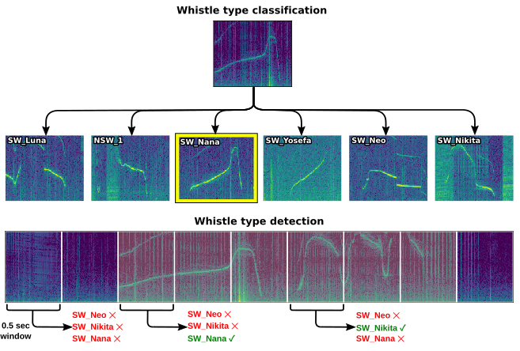

# OpenWhistle benchmark

Frozen **audio embeddings** followed by **linear probes** (logistic regression) on the expert-annotated Hugging Face datasets. This folder reproduces the paper’s **classification** and **detection** benchmark numbers.

<p align="center">
  
</p>

## Tasks (what each benchmark measures)

### Classification (`--dataset_name classification`)

- **Goal:** assign each short clip to a **single whistle type** (multiclass).
- **Data:** [dolphinteam/OpenWhistle-Classification-Finetuning](https://huggingface.co/datasets/dolphinteam/OpenWhistle-Classification-Finetuning) (default config `balanced`), with **train / validation / test** splits.
- **Head:** one multinomial **logistic regression** on the embedding.
- **Validation:** among inverse-regularization strengths **C ∈ {0.1, 1, 10}**, keep the **C** that maximizes **validation macro-F1**.
- **Test:** refit on **train ∪ validation** with the chosen **C**; report **test macro-F1** (mean over several RNG seeds, with bootstrap dispersion; see `train_lr_splits.py`).

### Detection (`--dataset_name detection`)

- **Goal:** for each analysis window, predict **which whistle types are present** (multi-label, one binary sub-task per type).
- **Data:** [dolphinteam/OpenWhistle-Detection-Finetuning](https://huggingface.co/datasets/dolphinteam/OpenWhistle-Detection-Finetuning) (`default` config), loaded from the dataset repository’s `data/` tree (see `src/hf_datasets.py`). Splits: **train / validation / test**.
- **Label vector:** seven binary dimensions (signature whistles **SW_***, one non-signature bucket **NSW_1**), as in `DETECTION_ONE_HOT_COLUMNS` in `hf_datasets.py`.
- **Head:** **MultiOutputClassifier** over logistic regressions (one classifier per label).
- **Validation:** choose **C** that maximizes **validation mean average precision (mAP)** over labels (probability-based; see `metrics.py`).
- **Test:** same refit protocol as classification; primary score is **test mAP** (again with seed and bootstrap summaries in `train_lr_splits.py`).

Shared preprocessing: embeddings are optionally **standardized** (`StandardScaler` fit on the training portion used for each stage) before logistic regression, unless `--no_normalize_data` is passed.

## Metrics

For the separate Watkins/BEANS transfer experiment, see [WATKINS.md](WATKINS.md).
Its cached probe uses validation macro-F1 selection and documents the historical
accuracy discrepancy, exact splits, uncertainty and remaining extraction work.

| Setting | Primary metric | Notes |
|--------|----------------|--------|
| **Classification** | **Macro-F1** | Unweighted mean of the per-class F1 scores on the held-out test split. |
| **Detection** | **Mean average precision (mAP)** | Class-wise average precision from ranked scores, then averaged across the seven binary heads (`MeanAveragePrecision` in `metrics.py`). |

## Embedding backbones (`--model`)

All models map each clip’s waveform to a **fixed vector**; only the linear probe is trained for the benchmark.

| `--model` | Description |
|-----------|-------------|
| **`mfcc`** | Time-averaged **MFCC** features (librosa). |
| **`spectrogram`** | Time-averaged **log-mel spectrogram** (128 mels). |
| **`spectral_features`** | Concatenated time-averaged **spectral centroid, bandwidth, contrast, rolloff**. |
| **`dolph2vec`** | **Wav2Vec2**-style pretrained on OpenWhistle corpus. |
| **`biolingual`** | **CLAP**-style audio embedding (`davidrrobinson/biolingual`), 48 kHz pipeline. |
| **`aves_core`** | **AVES** “core” checkpoint (44.1 kHz). |
| **`aves_bio`** | **AVES** “bio” variant. |

## Installation

Use Python 3.12 and install the benchmark dependencies with pip:

```bash
cd experiments/benchmark
python -m pip install --upgrade pip
python -m pip install -r requirements.txt
```

The requirements include the standard audio/ML stack plus `esp-aves`, which
provides the `aves` feature extractor used by the AVES benchmark models. If you
need a specific CUDA or CPU PyTorch wheel, install `torch` and `torchaudio` from
the matching PyTorch index before installing the requirements.

## Run everything (all models × both tasks)

From this directory:

```bash
export PYTHONPATH="${PWD}/src"
./run_all.sh
```

`run_all.sh` loops over every `--model` above and invokes `train_lr_splits.py` for **classification** and **detection** with **C ∈ {0.1, 1.0, 10.0}** (open `run_all.sh` for the exact command sequence).

### Single model / single task

```bash
cd experiments/benchmark
export PYTHONPATH="${PWD}/src"
python src/train_lr_splits.py --model dolph2vec --dataset_name classification --inverse_regs 0.1 1.0 10.0
python src/train_lr_splits.py --model dolph2vec --dataset_name detection --inverse_regs 0.1 1.0 10.0
```

Useful flags (see `train_lr_splits.py`): `--seed`, `--num_seeds`, `--num_bootstrap`, `--no_normalize_data`, `--target_sample_rate`, `--dataset_config` (classification: `balanced`, `unbalanced`, `all`). `--classification_config` is accepted as an alias for `--dataset_config`.

### Pretraining-size ablations and Hub checkpoints

`src/hf_collection_models.py` is the source of truth for the checkpoints to
evaluate. The collection runner evaluates every listed checkpoint on:

- classification `balanced`;
- classification `unbalanced`;
- classification `all`;
- detection `default`.

From the repository root:

```bash
bash experiments/benchmark/run_rebuttal_benchmark.sh
```

This command is configured for a 16 GB NVIDIA GPU: batch size 64, FP16,
eight audio-decoding threads, TF32 matrix multiplications, and resumable split
embedding caches. If a batch exceeds GPU memory, it is recursively divided.
Completed model/task/config triples are skipped when the command is restarted.

The runner uses 44.1 kHz waveforms for the standard AVES checkpoints. For the
BTB3 checkpoints it reproduces the continued-pretraining transform: three
frequency bands are derived from the original 44.1 kHz waveform, encoded as
three separate 16 kHz views, time-pooled, and concatenated into a 2304-D
embedding.

Results are written to `results/hf_collections_benchmark.csv`; the Markdown
and LaTeX tables are rebuilt automatically after all evaluations finish.

The frozen collection includes native AVES Stage-1/Stage-2 exports alongside
Transformers checkpoints. For the exact AVES from-scratch and Wav2Vec2
10/50/100% checkpoint mapping, table and commands, see [PRETRAINING.md](PRETRAINING.md).
`--collection rebuttal_pretraining --classification_configs all` selects the
five pretraining checkpoints used in the rebuttal; the native AVES exports use
their own loader and are excluded from Transformers supervised fine-tuning.

## Outputs

- Appended lines under **`results/`**, mainly **`results_classification.txt`** and **`results_detection.txt`**, from `train_lr_splits.py`.

For the high-level repository layout, CNN branch, and dataset overview figures, see the [root README](../../README.md) and [`datasets_figures/`](../../datasets_figures/README.md).

## Open-set evaluation

```bash
bash experiments/benchmark/run_openset.sh
```

Run this command from the repository root. It evaluates Dolph2Vec, BioLingual,
and AVES-bio with each of five held-out whistle classes from the rebuttal.
`src/train_lr_openset.py --held_out_class SW_Luna --dataset_config balanced`
evaluates another class or dataset configuration. The held-out class is removed
from training and validation. C is selected by known-class validation macro-F1;
the rejection threshold is calibrated on known validation samples before the
final probe is refit on train + validation. This is the original rebuttal
protocol: the acceptance rate is a calibration target, not a guarantee for the
refitted model. Outputs go to `results/results_openset.txt`.

## UMAP and detection ROC

From the repository root:

```bash
python experiments/benchmark/src/plot_umap_dolph2vec_classification.py --config_name all
python experiments/benchmark/src/roc_glotin.py --help
python experiments/benchmark/src/plot_roc_micro.py
```

UMAP requires the optional dependency `umap-learn` (`python -m pip install umap-learn`). Its default visualization
includes train, validation, and test; it is descriptive, not a test metric.
The ROC comparison reads previously exported test predictions from
`results/roc_curves/`. See `roc_glotin.py --help` to reproduce the per-model
exports before plotting.

Historical F1/accuracy, open-set, and UMAP results imported from feature branches
are preserved separately from the structured v5 rebuttal tables. See the
[branch review](../../docs/camera-ready-review.md) for provenance.

The former `faadil/F1` pretraining-size entry point is available as
`bash experiments/benchmark/run_pretrain_variants.sh`. It uses the shared Hub
registry and the current embedding pipeline on `balanced` and `all`. Use
`--model_ids` to restrict the sweep. The standard benchmark continues to run
both classification and detection.
